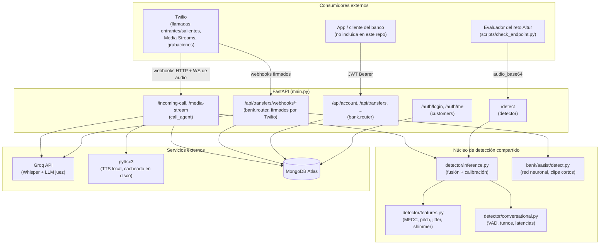
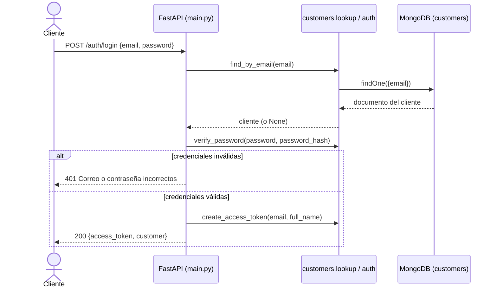
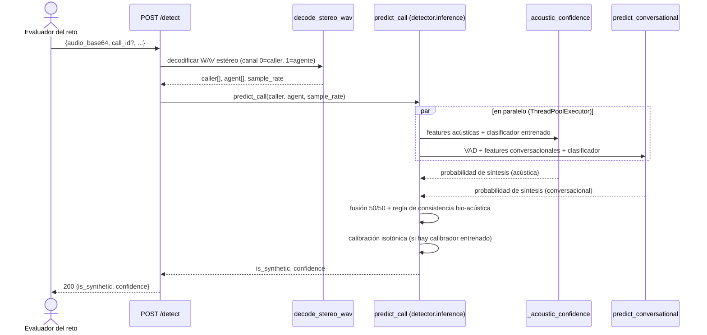
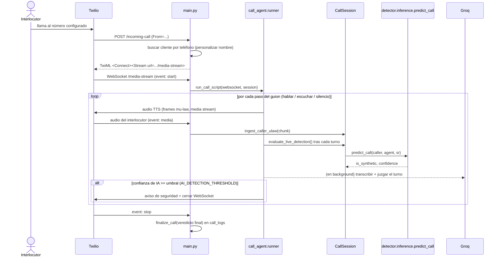
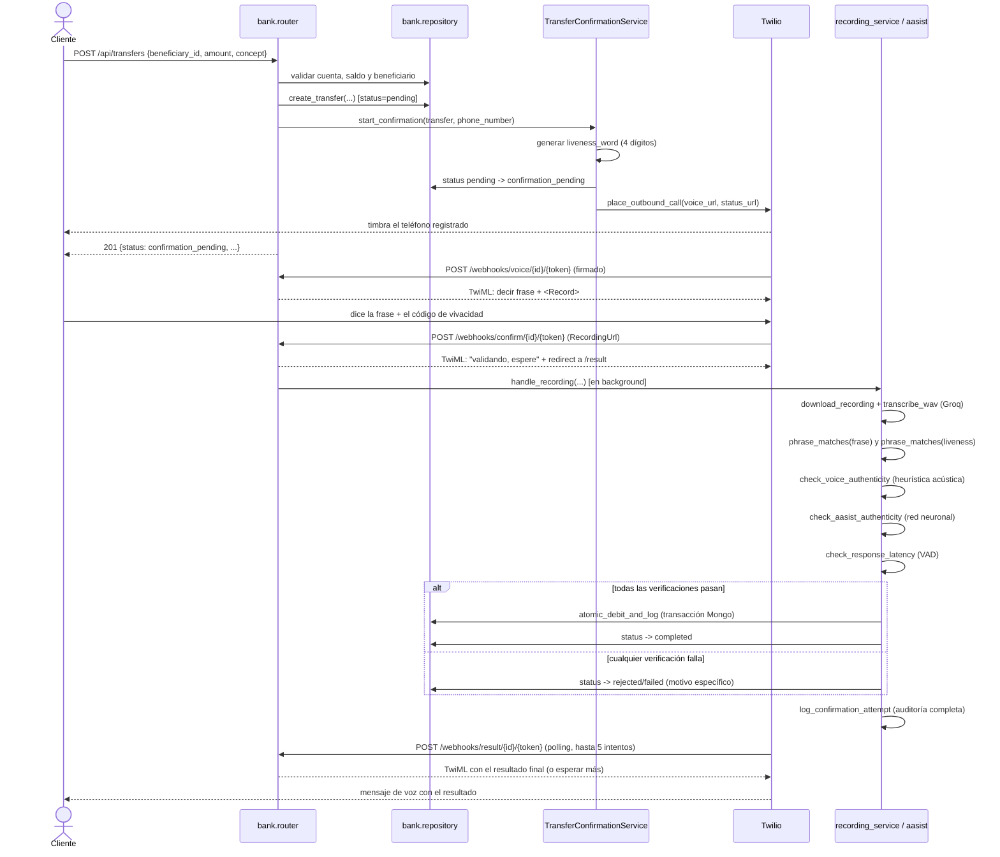
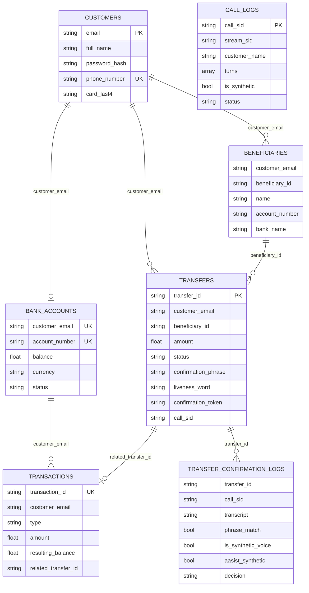

# project-api — Detección de voz sintética y confirmación segura de transferencias bancarias

> API en FastAPI construida para el reto **Altur** (HackMTY 2026): detecta si una llamada telefónica es una voz sintética/IA (deepfake de voz) y protege transferencias bancarias con una llamada de confirmación por voz que valida, en tiempo real, que quien confirma es una persona real y no un ataque automatizado.

Este documento es la referencia técnica y arquitectónica del proyecto. Está construido leyendo directamente el código fuente presente en este repositorio (no se documentan funcionalidades hipotéticas ni tecnologías no utilizadas). Donde algo es ambiguo o quedó pendiente de validar en producción, se indica explícitamente.

---

## Índice

1. [Presentación del proyecto](#1-presentación-del-proyecto)
2. [Características principales](#2-características-principales)
3. [Arquitectura general](#3-arquitectura-general)
4. [Stack tecnológico](#4-stack-tecnológico)
5. [Justificación de las decisiones tecnológicas](#5-justificación-de-las-decisiones-tecnológicas)
6. [Flujos de la aplicación](#6-flujos-de-la-aplicación)
7. [Estructura del proyecto](#7-estructura-del-proyecto)
8. [Backend: módulos y responsabilidades](#8-backend-módulos-y-responsabilidades)
9. [Frontend](#9-frontend)
10. [Base de datos](#10-base-de-datos)
11. [Autenticación y autorización](#11-autenticación-y-autorización)
12. [Integraciones externas](#12-integraciones-externas)
13. [Instalación y configuración](#13-instalación-y-configuración)
14. [Desarrollo local](#14-desarrollo-local)
15. [Convenciones y reglas del proyecto](#15-convenciones-y-reglas-del-proyecto)
16. [Seguridad](#16-seguridad)
17. [Estado actual del proyecto](#17-estado-actual-del-proyecto)
18. [Limitaciones y consideraciones](#18-limitaciones-y-consideraciones)
19. [Decisiones arquitectónicas](#19-decisiones-arquitectónicas)
20. [Roadmap / Propuestas](#20-roadmap--propuestas)
21. [Preguntas fundamentales respondidas](#21-preguntas-fundamentales-respondidas)

---

## 1. Presentación del proyecto

### ¿Qué es?

`project-api` es el backend (API + lógica de negocio) de una solución antifraude para banca telefónica, desarrollada para el reto **Altur** de HackMTY 2026. Es una API construida sobre **FastAPI** que combina tres capacidades:

1. **Detección de voz sintética en llamadas grabadas** (`POST /detect`): recibe un audio estéreo (canal del cliente + canal del agente) y devuelve si la voz del cliente es sintética (generada por IA / clonación de voz) junto con una confianza calibrada.
2. **Un agente de llamada en vivo sobre Twilio Media Streams** (`/incoming-call` + `/media-stream`): contesta llamadas entrantes, ejecuta un guion conversacional con "trampas" (interrupciones, silencios, preguntas sobre datos inexistentes) y evalúa en tiempo real, turno a turno, si quien habla es una IA.
3. **Un simulador de banca digital con transferencias protegidas por confirmación de voz** (`/api/*`): un cliente autenticado crea una transferencia, el sistema llama por teléfono al número registrado del cliente, le pide decir una frase de confirmación más un código de vivacidad generado al momento, graba la respuesta, y solo libera el dinero si la frase es correcta, la voz no parece sintética/replay y el tiempo de respuesta es consistente con una persona real leyendo la pantalla de su celular.

### Problema que resuelve

Los ataques de **vishing** (voice phishing) y **clonación de voz por IA** están rompiendo los mecanismos tradicionales de verificación telefónica en banca: un atacante puede clonar la voz de un cliente o de un agente y hacerse pasar por él en una llamada. El proyecto ataca este problema desde dos ángulos:

- **Detección forense**: dado el audio de una llamada ya ocurrida, decide si fue generada por IA (endpoint `/detect`, el contrato oficial evaluado por el juez del reto).
- **Prevención activa**: en el flujo bancario real, ninguna operación sensible (una transferencia) se completa solo con "decir la frase correcta" — se exige además vivacidad (algo que no pudo prepararse con anticipación) y ausencia de señales de síntesis de voz o de reproducción grabada (*replay attack*).

### Contexto

El proyecto nace de un dataset y una evaluación oficial provistos por el reto Altur: un conjunto de llamadas etiquetadas como humanas o sintéticas (`hackmty26/manifest.csv` + `audio/*.wav`, dataset externo no incluido en este repositorio) y un script evaluador (`scripts/check_endpoint.py`, tampoco incluido aquí) que mide precisión, calibración probabilística (Brier score) y latencia del endpoint `/detect`. [PLAN.md](PLAN.md) documenta la evolución medida de esas métricas a lo largo de dos fases de optimización.

Sobre esa base de detección, el equipo construyó un caso de uso bancario completo (autenticación de clientes, cuentas, transferencias, beneficiarios) para demostrar el detector aplicado a un escenario real: confirmar una transferencia por voz de forma segura.

### Usuarios objetivo

- **Clientes del banco simulado**: se autentican en la app (no incluida en este repositorio, solo su API) para ver su cuenta, beneficiarios y transferencias, y reciben una llamada telefónica real (vía Twilio) para confirmar cada transferencia que crean.
- **El evaluador del reto Altur**: consume directamente `POST /detect` con audios de prueba.
- **El equipo de desarrollo**: opera la API, entrena los modelos de detección (`detector/train.py`, `detector/calibrate.py`, `scripts/train_voice_classifier.py`) y da seguimiento a los registros de cada llamada y cada intento de confirmación en MongoDB.

### Capacidades principales (resumen)

- Clasificación binaria (humano/sintético) con confianza calibrada sobre audio de llamada completa.
- Agente de voz saliente/entrante sobre Twilio con TTS local cacheado en disco.
- Verificación de vivacidad de dos factores (frase dinámica + código de 4 dígitos generado al marcar) para transferencias bancarias.
- Triple verificación de la grabación de confirmación: coincidencia de frase (fuzzy matching), heurística acústica de síntesis, red neuronal AASIST especializada en clips cortos, y latencia de respuesta.
- Registro exhaustivo en MongoDB de cada llamada, cada turno conversacional y cada intento de confirmación, incluyendo el desglose de cada señal individual (no solo el veredicto final).

---

## 2. Características principales

### Autenticación y clientes (`customers/`)
- Login con email + contraseña (`POST /auth/login`), hash **PBKDF2-HMAC-SHA256** (200,000 iteraciones) con salt aleatorio.
- Sesión basada en **JWT** (HS256, expiración de 12 horas) sin estado en servidor.
- Endpoint de verificación de sesión (`GET /auth/me`).
- Resolución de clientes por número de teléfono normalizado a E.164 (usada para identificar al cliente que llama y personalizar el guion con su nombre).

### Detección de voz sintética — llamada completa (`detector/`)
- Extracción de features acústicas puras de señal (MFCC, pitch/jitter/shimmer por autocorrelación, planitud espectral, piso de ruido, ratio de silencio digital) sin dependencias de metadatos del dataset.
- Extracción de features conversacionales (turnos de habla vía VAD por energía RMS adaptativa, latencias de respuesta, interrupciones, solapamientos, reacción a silencios largos del agente).
- Modelo acústico (LightGBM/GradientBoosting, `detector/model/classifier.joblib`) y modelo conversacional (regresión logística, `detector/conversational_model.joblib`) entrenados por separado.
- Fusión de ambas señales por promedio ponderado (50/50) más una regla de consistencia bio-acústica para evitar falsos positivos cuando la señal acústica es decididamente humana.
- Calibración final de probabilidad con **regresión isotónica** entrenada sobre predicciones *out-of-fold* (`detector/model/calibrator.joblib`).
- Pre-carga de modelos y "calentamiento" de las rutinas numéricas en el arranque de la aplicación (`lifespan` de FastAPI) para eliminar el pico de latencia de la primera petición.

### Agente de llamada en vivo (`call_agent/`)
- Contesta llamadas entrantes de Twilio vía `<Connect><Stream>` (WebSocket bidireccional de audio mu-law 8kHz).
- Ejecuta un guion fijo de "trampas" conversacionales (`call_agent/script.py`): pide confirmar datos, corta el tiempo de escucha antes de que el interlocutor termine de hablar, pregunta por un producto que no existe, y guarda silencio deliberado 6 segundos para observar la reacción.
- Evalúa **en vivo, turno a turno**, si el audio acumulado del interlocutor es sintético, reutilizando el mismo modelo híbrido acústico + conversacional de `detector/`.
- Si la confianza de detección de IA supera un umbral configurable, puede **cortar la llamada automáticamente** avisando al interlocutor (comportamiento activable/desactivable por variable de entorno).
- En paralelo, envía cada segmento de audio del interlocutor a un LLM (Groq, Whisper + `gpt-oss-120b`) para un juicio semántico independiente ("¿la respuesta suena humana?"), como segunda señal registrada junto al veredicto del modelo ML.
- Texto a voz local (pyttsx3, voz "Sabina" en español de México) con cacheo en disco por hash del texto, para no re-sintetizar frases repetidas.

### Banca simulada y transferencias protegidas (`bank/`)
- Consulta de cuenta, historial de movimientos paginado y lista de beneficiarios, todo aislado por cliente autenticado.
- Creación de transferencias con validación de saldo y de beneficiario antes de iniciar cualquier llamada.
- Flujo completo de confirmación telefónica saliente (Twilio) dirigido por webhooks firmados:
  - Frase de confirmación única por transferencia (ancla fija + 2 palabras dinámicas), visible solo en la app.
  - Código de vivacidad de 4 dígitos generado **en el momento de marcar** la llamada (nunca antes, nunca en la app), para impedir que un audio sintético se prepare con anticipación.
  - Grabación de la respuesta y análisis en segundo plano (no bloquea el flujo de voz de Twilio) que combina:
    - coincidencia difusa de frase y de código de vivacidad (`bank/phrase_match.py`),
    - heurística determinística de síntesis de voz sobre pitch/jitter/shimmer + ratio de silencio digital (`bank/recording_service.py`),
    - red neuronal **AASIST** preentrenada especializada en clips cortos (`bank/aasist/`),
    - verificación de la latencia de respuesta antes de la primera palabra.
  - Débito atómico de saldo y registro del movimiento dentro de una **transacción multi-documento de MongoDB** solo si todas las verificaciones pasan.
  - Reintentos de estado idempotentes: cada transición de estado se aplica solo si el estado actual esperado coincide, para que un reintento de webhook de Twilio no procese dos veces la misma transferencia.
- Registro detallado de cada intento de confirmación (transcripción, cada señal individual y su razonamiento) en una colección separada de auditoría.

---

## 3. Arquitectura general

El proyecto es **una única API monolítica de FastAPI** (no hay frontend en este repositorio; ver [sección 9](#9-frontend)) que expone tres superficies de integración distintas sobre la misma base de código y los mismos modelos de detección:



Puntos clave de esta arquitectura, verificables en el código:

- **Un solo proceso FastAPI** (`main.py`) monta el router de `bank` y define directamente las rutas de detección, autenticación y el WebSocket de Twilio.
- **MongoDB (Atlas) vía Motor (driver async)** es la única base de datos, compartida por los módulos `customers`, `bank` y `call_logs` (cada uno con su propio conjunto de colecciones dentro de la misma base de datos, ver [sección 10](#10-base-de-datos)).
- El **núcleo de detección** (`detector/`) es reutilizado tanto por el endpoint `/detect` como por la evaluación en vivo del agente de llamada (`call_agent/session.py` importa directamente `detector.inference.predict_call`), evitando duplicar lógica de modelo.
- El flujo de **confirmación de transferencias** (`bank/`) usa una ruta de detección de voz *distinta y más simple* (heurística determinística + AASIST), no el clasificador principal de `detector/`, porque ese modelo está calibrado para llamadas completas y no generaliza a clips cortos de una sola frase (ver nota en `bank/recording_service.py` y [sección 18](#18-limitaciones-y-consideraciones)).
- No hay cola de mensajería ni workers separados: el trabajo en segundo plano (analizar una grabación, juzgar un turno con un LLM) se ejecuta con `asyncio.create_task` / `asyncio.to_thread` dentro del mismo proceso.

---

## 4. Stack tecnológico

| Tecnología | Dónde se usa | Responsabilidad |
|---|---|---|
| **FastAPI** | `main.py`, `bank/router.py` | Framework HTTP/WebSocket, definición de rutas, validación de payloads con Pydantic. |
| **Uvicorn** (vía `fastapi[standard]`) | Servidor ASGI | Ejecuta la app en desarrollo (`fastapi dev`) y producción. |
| **Pydantic** | `*/schema.py` | Modelos de request/response con validación automática (tipos, `EmailStr`, rangos). |
| **Motor** (`motor.motor_asyncio`) | `customers/db.py`, `bank/db.py`, `call_logs/store.py` | Driver async de MongoDB; toda la persistencia de la app pasa por aquí. |
| **MongoDB Atlas** | Base de datos remota | Persistencia de clientes, cuentas, transferencias, logs de llamadas y de confirmaciones; soporta transacciones multi-documento usadas en el débito atómico. |
| **PyJWT** | `customers/tokens.py` | Emisión/verificación de tokens de sesión (HS256). |
| **hashlib/PBKDF2 (stdlib)** | `customers/auth.py` | Hash de contraseñas sin dependencias externas de cripto. |
| **python-dotenv** | `customers/db.py`, `customers/tokens.py`, `bank/twilio_service.py`, `call_agent/*` | Carga variables de entorno desde `.env` en desarrollo. |
| **NumPy / SciPy** | `detector/features.py`, `detector/conversational.py` | Vectorización numérica: framing de señal, FFT/autocorrelación para pitch, filtros de mel, VAD por energía RMS. |
| **soundfile** | `detector/inference.py`, `bank/aasist/detect.py`, `bank/recording_service.py` | Decodificación de WAV (ruta de respaldo cuando el header no es PCM16 estándar). |
| **pybase64** (con *fallback* a `base64` stdlib) | `detector/inference.py` | Decodificación acelerada (SIMD) del payload Base64 de `/detect`, que puede pesar varios MB. |
| **scikit-learn** | `detector/train.py`, `detector/calibrate.py`, `scripts/train_voice_classifier.py` | `StandardScaler`, `LogisticRegression`, `IsotonicRegression`, métricas de evaluación (AUC, Brier, accuracy). |
| **LightGBM** (con *fallback* a `GradientBoostingClassifier` de scikit-learn si no está instalado) | `detector/train.py`, `detector/calibrate.py` | Clasificador de gradient boosting para la señal acústica principal. |
| **joblib** | `detector/inference.py`, `detector/conversational.py`, `bank/aasist/detect.py` (pesos vía `torch.load`) | Serialización de modelos/escaladores entrenados a disco. |
| **PyTorch** | `bank/aasist/model.py`, `bank/aasist/detect.py` | Ejecuta la red neuronal preentrenada AASIST (arquitectura *Graph Attention* para anti-*spoofing* de voz). |
| **Twilio (`twilio` SDK)** | `bank/twilio_service.py`, `bank/security.py`, `main.py` | Origina llamadas salientes, genera TwiML de respuesta, valida la firma HMAC de cada webhook entrante. |
| **Groq (`groq` SDK, `AsyncGroq`)** | `call_agent/semantic.py`, `bank/recording_service.py` | Transcripción de audio (Whisper `whisper-large-v3-turbo`) y, en el agente en vivo, juicio semántico con un LLM (`openai/gpt-oss-120b`) sobre si una respuesta "suena humana". |
| **pyttsx3** | `call_agent/tts.py` | Síntesis de voz local (TTS) para el guion del agente, usando la voz "Sabina" (es-MX) del motor de voz de Windows/SAPI. |
| **audioop-lts** | `call_agent/session.py`, `call_agent/tts.py` | Reimplementación del módulo `audioop` de la stdlib (eliminado de Python 3.13+) para conversión mu-law↔PCM y resampleo de audio telefónico. |
| **httpx** | `bank/recording_service.py`, `tests/conftest.py` | Cliente HTTP async: descarga de grabaciones de Twilio con auth básica, y cliente de pruebas contra la app ASGI. |
| **pandas** | `detector/calibrate.py`, scripts de entrenamiento | Carga y manipulación del manifiesto del dataset de entrenamiento. |
| **pytest / pytest-asyncio** | `tests/` | Suite de pruebas automatizadas (unitarias y de integración contra MongoDB de prueba). |

**Dependencias declaradas en `requirements.txt` sin uso detectado en el código de la aplicación:** `google-genai`. La variable `GEMINI_API_KEY` existe en `.env`, pero no se encontró ninguna importación de `google.genai` ni referencia a esa variable en `bank/`, `call_agent/`, `customers/`, `detector/` ni `main.py`. Se documenta como ambiguo — puede ser un remanente de una integración explorada y no completada, no una funcionalidad activa.

---

## 5. Justificación de las decisiones tecnológicas

> Esta sección distingue explícitamente entre **"así está implementado hoy"** (con evidencia en el código o en `PLAN.md`) y **cualquier recomendación**, que se marca aparte en la [sección 20](#20-roadmap--propuestas).

- **FastAPI + Pydantic**: el contrato de `/detect` es estricto (lo define el evaluador del reto) y Pydantic permite declarar y validar ese contrato (`detector/schema.py`) sin código manual. FastAPI además da soporte nativo a WebSockets (`/media-stream`), necesario para el streaming bidireccional de audio de Twilio.
- **Motor (MongoDB async) en vez de un driver síncrono**: toda la API es `async def`; usar un driver síncrono de Mongo bloquearía el *event loop* durante cada consulta. Motor permite mantener el servidor respondiendo a otras peticiones (incluidos los webhooks de Twilio) mientras hay operaciones de base de datos en curso.
- **JWT sin estado en vez de sesiones en servidor**: no hay almacenamiento de sesión en Mongo ni en memoria — el token contiene `sub` (email) y expiración, y cada request lo revalida contra la base solo para confirmar que el cliente sigue existiendo (`customers/deps.py`). Esto simplifica escalar la API horizontalmente sin *sticky sessions*.
- **PBKDF2 de la stdlib en vez de bcrypt/argon2**: evita una dependencia binaria adicional; 200,000 iteraciones es un valor deliberadamente alto para compensar el uso de SHA-256 en vez de un algoritmo memory-hard (documentado como decisión, no como recomendación futura).
- **Separación de dos "detectores" distintos (`detector/` para llamada completa vs. heurística+AASIST para clips cortos en `bank/`)**: el propio código documenta por qué (`bank/recording_service.py`): el clasificador principal está entrenado y calibrado sobre llamadas largas del dataset del reto y, al aplicarse a clips de unos segundos, "daba siempre ~0.01 sin importar el audio". En vez de forzar un modelo fuera de su dominio de entrenamiento, se usa una heurística determinística de bajo costo más un modelo neuronal (AASIST) específicamente evaluado contra clips cortos.
- **Fusión acústica + conversacional al 50/50 (no aprendida)**: `detector/inference.py` documenta que, en las 71 llamadas de validación del reto, ponderar más la señal acústica no mejoraba el resultado (mismo *accuracy*/AUC), así que se prefirió el peso fijo más simple de explicar y auditar.
- **Calibración isotónica sobre predicciones *out-of-fold*, no sobre el set de validación directo**: `detector/calibrate.py` documenta que calibrar contra `val` (donde el ensamble ya acierta el 100%) produce una curva en escalón que generaliza mal a casos nuevos; usar *out-of-fold* sobre `train` fuerza a que aparezcan errores y casos límite reales para calibrar contra ellos.
- **`float32` nativo + `pybase64` + `ThreadPoolExecutor` de 4 hilos**: cambios de rendimiento medidos y documentados en detalle en [PLAN.md](PLAN.md), motivados directamente por los criterios de evaluación del reto (latencia media y máxima), no por una preferencia estética de rendimiento.
- **Límite de 60 segundos para el análisis bio-acústico** (`max_seconds` en `detector/features.py` / `detector/inference.py`): validado empíricamente contra las 71 llamadas del set de validación — recortar a 60s (de audios que promedian 148s) mantiene 100% de aciertos y reduce drásticamente el cómputo de FFT/autocorrelación.
- **Twilio para telefonía en vez de una integración VoIP propia**: Twilio da de forma administrada tanto la llamada saliente (confirmación de transferencias) como el streaming de audio bidireccional en tiempo real (`<Connect><Stream>`) necesario para el agente conversacional, más la firma HMAC de cada webhook para autenticar que la petición viene realmente de Twilio.
- **Groq (Whisper + LLM) en vez de un modelo local de transcripción/juicio semántico**: permite baja latencia con hardware modesto y, mediante rotación entre varias API keys (`GROQ_API_KEYS` separadas por coma), mitiga los límites de *rate limiting* del servicio gratuito/de prueba.
- **pyttsx3 (TTS local) en vez de un servicio de síntesis en la nube para el guion del agente**: evita latencia de red y costo por llamada al servicio externo; se compensa cacheando en disco (`call_agent/tts_cache/`) el audio de cada frase distinta, ya que el guion es mayormente fijo.
- **Frase de confirmación dinámica + código de vivacidad generado al marcar (no una contraseña fija)**: documentado extensamente en `bank/phrase_generator.py` y `bank/confirmation_service.py` — una frase visible con minutos de anticipación en la app es insuficiente por sí sola (se puede preparar un audio sintético con esa frase antes de que suene el teléfono); el código de 4 dígitos no existe hasta el instante en que se origina la llamada, cerrando esa ventana de preparación.

---

## 6. Flujos de la aplicación

### 6.1 Autenticación de un cliente



Cada request subsecuente a `/auth/me` o a cualquier ruta de `/api/*` envía `Authorization: Bearer <token>`; `customers/deps.get_current_customer` decodifica el JWT y vuelve a buscar al cliente en Mongo (para invalidar tokens de clientes eliminados) antes de inyectarlo en el endpoint.

### 6.2 Detección de voz sintética sobre una llamada completa (`/detect`)

Este es el contrato oficial evaluado por el juez del reto (`detector/schema.py` documenta explícitamente que replica `scripts/check_endpoint.py` del repositorio del reto, no incluido aquí).



### 6.3 Llamada entrante con agente conversacional en vivo



Cada turno se registra en la colección `call_logs` con el veredicto del modelo ML y, en paralelo, el veredicto semántico del LLM — ambos quedan disponibles para auditoría aunque solo el modelo ML puede disparar el corte automático de la llamada.

### 6.4 Creación y confirmación de una transferencia bancaria



Notas de este flujo, verificadas en el código:

- La frase de confirmación **nunca se dice en la llamada**; solo se pide y se le indica al cliente que la diga (`build_confirmation_twiml`), precisamente para que no sirva como referencia a un atacante que solo esté escuchando.
- El webhook de estado (`/webhooks/status/{id}/{token}`) marca la transferencia como `failed` si Twilio reporta `no-answer`, `busy`, `failed` o `canceled`.
- Toda transición de estado usa actualización condicional (`update_transfer_status` con `expected_status`), de forma que un reintento de webhook de Twilio no pueda reprocesar ni doble-debitar una transferencia.

---

## 7. Estructura del proyecto

```text
project-api/
├── main.py                    # Entry point de FastAPI: rutas de auth, /detect, Twilio (incoming-call, media-stream)
├── requirements.txt           # Dependencias de Python
├── pytest.ini                 # Configuración de pytest (modo async)
├── PLAN.md                    # Historial documentado de optimización de latencia/precisión de /detect
├── .env                       # Variables de entorno (no versionado)
│
├── customers/                 # Identidad y autenticación de clientes del banco
│   ├── auth.py                #   hash/verificación de contraseña (PBKDF2)
│   ├── db.py                  #   conexión a Mongo (Motor) + colección "customers"
│   ├── deps.py                #   dependencia FastAPI: resolver cliente desde el JWT
│   ├── lookup.py               #   búsquedas por email / teléfono / tarjeta
│   ├── phone.py                #   normalización de teléfonos a E.164
│   ├── schema.py               #   modelos Pydantic (login, cliente)
│   ├── tokens.py                #   emisión/verificación de JWT
│   └── seed.py                  #   siembra de clientes de ejemplo (idempotente)
│
├── bank/                      # Banca simulada: cuentas, transferencias, confirmación por voz
│   ├── router.py                #   rutas /api/* (cuenta, transferencias, webhooks de Twilio)
│   ├── schema.py                 #   modelos Pydantic de cuenta/transacción/beneficiario/transferencia
│   ├── db.py                     #   colecciones de Mongo del dominio bancario
│   ├── repository.py             #   acceso a datos + débito atómico transaccional
│   ├── confirmation_service.py   #   orquesta el flujo de confirmación telefónica y el TwiML
│   ├── security.py               #   validación de firma HMAC de webhooks de Twilio
│   ├── twilio_service.py         #   wrapper para originar llamadas salientes
│   ├── phrase_generator.py       #   genera frase de confirmación y código de vivacidad
│   ├── phrase_match.py           #   comparación difusa de frases (tolerante a ASR)
│   ├── recording_service.py      #   descarga/transcribe grabación + heurística de síntesis + latencia
│   ├── confirmation_logs.py      #   auditoría de cada intento de confirmación
│   ├── seed.py                    #   siembra de cuentas/beneficiarios/movimientos de ejemplo
│   ├── models/                    #   voice_short_clip_classifier.joblib (entrenado, no referenciado en runtime — ver sección 18)
│   └── aasist/                    #   red neuronal AASIST vendorizada (NAVER/clovaai, MIT license)
│       ├── model.py                  #   arquitectura del modelo (PyTorch)
│       ├── detect.py                  #   wrapper de inferencia + umbral de decisión
│       └── AASIST.pth                  #   pesos preentrenados
│
├── detector/                   # Núcleo de detección de voz sintética (llamada completa)
│   ├── features.py               #   extracción de features acústicas puras de señal
│   ├── conversational.py         #   VAD, turnos, features conversacionales + modelo
│   ├── inference.py               #   decodificación de audio, fusión de señales, calibración
│   ├── schema.py                   #   modelos Pydantic de /detect
│   ├── train.py                     #   entrena classifier.joblib contra el dataset del reto
│   ├── calibrate.py                  #   entrena calibrator.joblib (isotónica, out-of-fold)
│   └── model/                          #   classifier.joblib, calibrator.joblib (artefactos entrenados)
│
├── call_agent/                  # Agente conversacional en vivo sobre Twilio Media Streams
│   ├── runner.py                  #   ejecuta el guion de llamada y coordina detección en vivo
│   ├── script.py                    #   guion fijo de "trampas" conversacionales
│   ├── session.py                    #   estado por llamada (buffers de audio, VAD, evaluación ML)
│   ├── semantic.py                    #   transcripción + juicio semántico vía Groq (LLM)
│   ├── tts.py                          #   texto a voz local (pyttsx3) con cache en disco
│   └── tts_cache/                        #   audios .ulaw pre-generados y cacheados
│
├── call_logs/                    # Persistencia de llamadas en vivo y sus turnos
│   └── store.py                    #   colección "call_logs": inicio, turnos, veredicto, cierre
│
├── scripts/                        # Herramientas de entrenamiento auxiliares (no parte del runtime de la API)
│   ├── build_voice_dataset.py         #   construye un dataset de clips cortos desde el dataset del reto
│   ├── train_voice_classifier.py       #   entrena bank/models/voice_short_clip_classifier.joblib
│   └── voice_dataset.csv                #   dataset intermedio generado
│
├── tests/                            # Suite de pruebas (pytest + pytest-asyncio)
│   ├── conftest.py                      #   fixtures: cliente ASGI, cliente/cuenta de prueba, base Mongo aislada
│   ├── test_bank_endpoints.py            #   flujo de transferencias end-to-end (mockeando Twilio/Groq)
│   ├── test_bank_repository.py
│   ├── test_detect_endpoint.py
│   ├── test_live_ai_detection.py
│   ├── test_phrase_generator.py
│   └── test_phrase_match.py
│
└── (raíz) explore_turns.py, test_audio_vad.py, test_detect_endpoint.py,
    feature_comparison.json, mongo_test_result*.json, transfer_resp.json
    # Scripts y salidas de exploración/depuración manual contra el dataset externo
    # "../hackmty26" (no incluido en este repo). No forman parte del runtime de
    # la API ni de la suite de pruebas oficial (tests/).
```

---

## 8. Backend: módulos y responsabilidades

El backend no sigue una separación MVC clásica de un solo dominio; está organizado **por dominio de negocio** (paquetes de Python), cada uno dueño de su propio acceso a datos:

| Módulo | Responsabilidad | Depende de |
|---|---|---|
| `customers` | Identidad: alta (seed), login, JWT, resolución de clientes por email/teléfono. | MongoDB (`customers`) |
| `bank` | Dominio bancario: cuentas, beneficiarios, transacciones, transferencias y su confirmación telefónica. | MongoDB (`bank_accounts`, `transactions`, `beneficiaries`, `transfers`, `transfer_confirmation_logs`), `customers` (auth), Twilio, Groq, `detector.features`, `bank.aasist` |
| `detector` | Modelo de detección de voz sintética reutilizable (entrenamiento + inferencia). | NumPy/SciPy/scikit-learn/LightGBM, artefactos `.joblib` |
| `call_agent` | Orquestación de una llamada en vivo: guion, síntesis de voz, evaluación en tiempo real. | `detector.inference`, Groq, `call_logs` |
| `call_logs` | Persistencia del historial de llamadas en vivo (no de transferencias). | MongoDB (`call_logs`) |
| `main.py` | Composición: registra el router de `bank`, define las rutas de auth/detect/Twilio de nivel superior, gestiona el ciclo de vida de la app (*warmup* de modelos). | todos los anteriores |

**Controladores**: FastAPI define las rutas directamente como funciones decoradas (`@app.get`, `@router.post`, etc.) en `main.py` y `bank/router.py` — no hay una capa de "controller" separada de la ruta. La lógica de negocio no trivial vive en **servicios** (`TransferConfirmationService`, `TwilioService`) y en módulos de función pura (`phrase_match`, `phrase_generator`, `recording_service`), mientras que el acceso a datos vive en `repository.py` / `lookup.py` / `db.py`.

**Modelos de datos**: no hay un ORM. Los documentos de MongoDB se leen/escriben como `dict` de Python directamente contra el driver Motor; los modelos Pydantic en cada `schema.py` solo definen el **contrato de entrada/salida HTTP**, no un mapeo objeto-relacional.

**Middleware**: `CORSMiddleware` está configurado en `main.py` con `allow_origins=["*"]`, `allow_methods=["*"]`, `allow_headers=["*"]` — abierto a cualquier origen (ver [sección 16](#16-seguridad) para la implicación de esto).

**Manejo de errores**: se usa `HTTPException` de FastAPI de forma explícita en cada ruta para condiciones de negocio (401 credenciales inválidas, 404 recurso no encontrado/no propio, 422 saldo insuficiente, 502 si falla el intento de originar la llamada de Twilio). Las excepciones no anticipadas en `/detect` y en el análisis en segundo plano de grabaciones se capturan, se registran con `logger.exception` y se traducen a una respuesta o a un estado `failed`, en vez de propagar un 500 sin contexto.

**Concurrencia**: la app es completamente `async`. El trabajo de CPU (inferencia de los modelos, extracción de features) se delega a hilos (`ThreadPoolExecutor` en `detector/inference.py`, `asyncio.to_thread` en `bank/confirmation_service.py`) para no bloquear el *event loop* mientras se atienden otras peticiones o el WebSocket de Twilio.

---

## 9. Frontend

**No existe frontend en este repositorio.** El código es exclusivamente una API (FastAPI); no hay directorios `frontend/`, `client/`, plantillas HTML servidas por la aplicación, ni un `package.json` en la raíz del proyecto. El README original del proyecto ya reflejaba esto ("API construida con FastAPI").

La API está diseñada para ser consumida por:
- Una aplicación cliente externa (móvil o web) para el flujo de banca (`/auth/*`, `/api/*`), autenticada con el JWT emitido en `/auth/login`.
- Twilio, como origen de las llamadas telefónicas (webhooks HTTP + WebSocket de audio).
- El evaluador del reto Altur, como consumidor directo de `/detect`.

Cualquier interfaz de usuario que consuma esta API vive fuera de este repositorio.

---

## 10. Base de datos

**Motor**: MongoDB (Atlas en producción, según sugiere el uso de transacciones multi-documento en `bank/repository.atomic_debit_and_log`, disponibles nativamente en Atlas). Nombre de base de datos por defecto: `altur_bank` (configurable con `MONGODB_DB_NAME`; los tests usan `altur_bank_test`, ver `tests/conftest.py`).

**No es una base relacional**: no hay migraciones ni esquema declarado a nivel de base de datos. Cada colección se crea implícitamente al primer `insert`/`upsert`, y los únicos índices explícitos son los que crean los scripts de siembra (`customers/seed.py`, `bank/seed.py`):

- `customers.phone_number` (único)
- `bank_accounts.customer_email` (único), `bank_accounts.account_number` (único)
- `beneficiaries.(customer_email, beneficiary_id)` (único compuesto)
- `transactions.transaction_id` (único)

### Colecciones y relación conceptual entre entidades



`CALL_LOGS` (llamadas en vivo del agente conversacional) es independiente del dominio de transferencias: no tiene relación con `TRANSFERS` ni con `CUSTOMERS` más allá de un `customer_name` de texto libre resuelto al inicio de la llamada — no hay una llave foránea real hacia `customers`.

**Ciclo de vida de una transferencia** (`status` en la colección `transfers`): `pending` → `confirmation_pending` → `completed` | `rejected` | `failed`. Cada transición se aplica de forma condicional sobre el estado anterior esperado (ver `repository.update_transfer_status`), lo que hace la máquina de estados segura frente a webhooks duplicados de Twilio.

---

## 11. Autenticación y autorización

- **Autenticación de clientes de la API** (`/api/*`, `/auth/me`): JWT Bearer, algoritmo **HS256**, firmado con el secreto `JWT_SECRET`. El token incluye `sub` (email), `name` y expiración (`exp`, 12 horas desde la emisión). No hay *refresh tokens*: al expirar, el cliente debe volver a autenticarse con `/auth/login`.
- **Autorización**: es implícita por propiedad del recurso, no por roles. Cada consulta de `bank/repository.py` filtra explícitamente por `customer_email` del token decodificado (p. ej. `get_transfer_owned_by`), de forma que un cliente autenticado nunca puede leer datos de otro cliente aunque conozca el ID del recurso (verificado en `tests/test_bank_endpoints.py::test_other_customer_cannot_see_foreign_transfer`). No existen roles de administrador ni niveles de permiso adicionales en el código.
- **Autenticación de los webhooks de Twilio** (`/api/transfers/webhooks/*`): no usa JWT. Usa la firma HMAC-SHA1 que Twilio agrega en el header `X-Twilio-Signature`, validada con `twilio.request_validator.RequestValidator` contra `TWILIO_AUTH_TOKEN` (`bank/security.py`). Además, cada URL de webhook incluye un **token de un solo uso por transferencia** (`confirmation_token`, generado con `secrets.token_urlsafe(24)`), por lo que conocer solo el `transfer_id` no es suficiente para interactuar con el webhook.
- **Autenticación de la voz en la llamada de confirmación**: no es un mecanismo de sesión, sino un esquema de **desafío-respuesta multifactor** ad hoc: algo que el cliente ya sabe (la frase, visible en la app) + algo generado en el instante (el código de vivacidad) + una verificación pasiva de que la voz no es sintética/repetida y de que el tiempo de respuesta es plausible.
- **Rutas de Twilio en `main.py` (`/incoming-call`, `/media-stream`) no pasan por `verify_twilio_signature`**, a diferencia de los webhooks bajo `/api/transfers/webhooks/*`. Esto se documenta como una observación de seguridad en la [sección 16](#16-seguridad), no como un hallazgo a corregir en esta tarea.

---

## 12. Integraciones externas

| Servicio | Para qué se usa | Dónde se integra | Información que intercambia |
|---|---|---|---|
| **Twilio Programmable Voice** | Contestar llamadas entrantes, originar llamadas salientes de confirmación, transmitir audio bidireccional en vivo (Media Streams), grabar la respuesta de confirmación. | `main.py` (`/incoming-call`, `/media-stream`), `bank/twilio_service.py`, `bank/router.py` (webhooks) | Metadatos de la llamada (`CallSid`, `From`, `CallStatus`), audio en tiempo real (frames mu-law 8kHz base64 sobre WebSocket), URL de la grabación de confirmación. |
| **Twilio (validación de firma)** | Confirmar que un webhook entrante realmente proviene de Twilio. | `bank/security.py` | Firma HMAC del header `X-Twilio-Signature` contra la URL y los parámetros del POST. |
| **Groq API (`AsyncGroq`)** | (1) Transcripción de audio con Whisper (`whisper-large-v3-turbo`); (2) juicio semántico de una respuesta con un LLM (`openai/gpt-oss-120b`), solo en el agente de llamada en vivo. | `bank/recording_service.py`, `call_agent/semantic.py` | Audio WAV del segmento de voz (saliente), transcripción y JSON de veredicto (entrante). Rota entre varias API keys (`GROQ_API_KEYS`, separadas por coma) para repartir *rate limits*. |
| **MongoDB Atlas** | Persistencia de todo el estado de negocio (clientes, cuentas, transferencias, logs de llamadas y de confirmaciones). | `customers/db.py`, `bank/db.py`, `call_logs/store.py` | Documentos JSON/BSON vía el protocolo nativo de MongoDB. |
| **pyttsx3 / motor de voz local (SAPI en Windows)** | Síntesis de voz del guion del agente. | `call_agent/tts.py` | Texto → audio WAV local; no sale de la máquina donde corre la API. |

No se detectaron integraciones con pasarelas de pago, proveedores de almacenamiento de archivos en la nube, ni proveedores de autenticación externos (OAuth/SSO). Ninguna credencial se encontró hardcodeada en el código: todas las llaves y secretos se leen exclusivamente de variables de entorno (`os.environ[...]`).

---

## 13. Instalación y configuración

### Requisitos previos

- **Python 3.10+**. El entorno de desarrollo local incluido en este repositorio (`.venv/`) usa **Python 3.14**; la dependencia `audioop-lts` existe precisamente porque el módulo `audioop` de la librería estándar fue removido en Python 3.13+ y el proyecto lo necesita para el procesamiento de audio telefónico (mu-law).
- Una base de datos **MongoDB** accesible (Atlas u otra instancia) — necesaria para prácticamente cualquier funcionalidad excepto `GET /` y `POST /detect`.
- Una cuenta de **Twilio** con un número con voz habilitada, si se va a probar el agente de llamada o el flujo de confirmación de transferencias.
- Una o más **API keys de Groq**, si se va a probar la transcripción/juicio semántico.
- En Windows, el motor de voz **SAPI** con la voz "Microsoft Sabina" instalada, si se va a probar la síntesis de voz local (`call_agent/tts.py`); si no está disponible, el código cae automáticamente a un tono telefónico genérico en vez de fallar.

### Variables de entorno

Definidas en un archivo `.env` en la raíz (cargado con `python-dotenv`; ver `.gitignore`, que ya excluye `.env`). Estas son las variables que el código lee explícitamente con `os.environ[...]` (obligatorias, la app falla si faltan) o `os.environ.get(...)` (opcionales, con valor por defecto):

| Variable | Obligatoria | Usada en | Propósito |
|---|---|---|---|
| `MONGODB_URI` | Sí | `customers/db.py` | Cadena de conexión a MongoDB. |
| `MONGODB_DB_NAME` | No (default `altur_bank`) | `customers/db.py`, `bank/db.py`, `call_logs/store.py` | Nombre de la base de datos a usar. |
| `JWT_SECRET` | Sí | `customers/tokens.py` | Secreto de firma de los JWT de sesión. |
| `TWILIO_ACCOUNT_SID` | Sí | `bank/twilio_service.py`, `bank/recording_service.py` | Identificador de cuenta de Twilio. |
| `TWILIO_AUTH_TOKEN` | Sí | `bank/twilio_service.py`, `bank/security.py`, `bank/recording_service.py` | Token de autenticación de Twilio (también usado para validar firmas de webhooks). |
| `TWILIO_FROM_NUMBER` | Sí (para llamadas salientes) | `bank/twilio_service.py` | Número de Twilio desde el que se origina la llamada de confirmación. |
| `PUBLIC_BASE_URL` | Sí (para el flujo de confirmación) | `bank/confirmation_service.py` | URL pública (HTTPS) de la API, usada para construir las URLs de los webhooks que Twilio debe invocar. Debe ser un túnel público (ver nota abajo) al desarrollar localmente. |
| `GROQ_API_KEYS` | Sí (para transcripción/juicio semántico) | `bank/recording_service.py`, `call_agent/semantic.py` | Una o más API keys de Groq separadas por coma, rotadas automáticamente. |
| `AI_DETECTION_THRESHOLD` | No (default `0.75`) | `call_agent/runner.py` | Umbral de confianza a partir del cual el agente en vivo reacciona a una detección de IA. |
| `AUTO_DISCONNECT_AI` | No (default `true`) | `call_agent/runner.py` | Si es `true`, corta automáticamente la llamada al detectar IA con confianza suficiente. |
| `GEMINI_API_KEY` | — | (sin uso detectado) | Presente en `.env` pero no referenciada en el código de la aplicación; ver [sección 4](#4-stack-tecnológico). |

> Para que Twilio pueda invocar los webhooks de esta API en desarrollo local, la API necesita ser accesible públicamente por HTTPS (por ejemplo, mediante un túnel como ngrok) y `PUBLIC_BASE_URL` debe apuntar a esa URL pública. `bank/security.py` reconstruye explícitamente el esquema de la URL a partir del header `X-Forwarded-Proto` para que la validación de firma funcione detrás de un proxy TLS-terminating como ngrok.

### Instalación de dependencias

```bash
python -m venv .venv
```

Activar el entorno virtual (Windows PowerShell):

```powershell
.venv\Scripts\Activate.ps1
```

Instalar dependencias:

```bash
pip install -r requirements.txt
```

### Base de datos: siembra de datos de ejemplo

Ambos scripts son idempotentes (usan `upsert` sobre llaves naturales), por lo que pueden ejecutarse varias veces sin duplicar datos:

```bash
python -m customers.seed
```

```bash
python -m bank.seed
```

`customers.seed` crea clientes de ejemplo (con contraseña de prueba `demo1234`) y el índice único de `phone_number`. `bank.seed` crea cuentas, beneficiarios y movimientos históricos de ejemplo asociados a esos mismos clientes por `customer_email`, además de los índices únicos del dominio bancario.

### Entrenamiento de los modelos de detección (opcional)

Los artefactos entrenados (`detector/model/classifier.joblib`, `detector/model/calibrator.joblib`, `detector/conversational_model.joblib`, `bank/models/voice_short_clip_classifier.joblib`) ya están presentes en el repositorio. Re-entrenarlos requiere el dataset externo del reto (`hackmty26/manifest.csv` + `audio/*.wav`), no incluido en este repositorio:

```bash
python -m detector.train --dataset-dir "ruta/a/hackmty26"
python -m detector.calibrate
python scripts/build_voice_dataset.py
python scripts/train_voice_classifier.py
```

---

## 14. Desarrollo local

1. **Obtener el proyecto**: clonar el repositorio.
2. **Instalar dependencias**: crear y activar el entorno virtual, `pip install -r requirements.txt` (ver [sección 13](#13-instalación-y-configuración)).
3. **Configurar variables de entorno**: crear `.env` en la raíz con, como mínimo, `MONGODB_URI` y `JWT_SECRET` para poder autenticar clientes; agregar las variables de Twilio/Groq si se va a probar el flujo de llamadas.
4. **Preparar la base de datos**: ejecutar `python -m customers.seed` y `python -m bank.seed` para tener clientes, cuentas y beneficiarios de prueba.
5. **Iniciar el servidor** (backend único, no hay frontend que iniciar por separado):
   ```bash
   fastapi dev main.py
   ```
   o, equivalente con Uvicorn:
   ```bash
   uvicorn main:app --reload --reload-exclude ".venv/*"
   ```
   > Sin `--reload-exclude ".venv/*"`, instalar cualquier paquete nuevo dispara un reinicio completo del servidor (pip modifica miles de archivos dentro de `.venv`), lo que corta cualquier llamada de Twilio en curso. Para una demo en vivo, se recomienda correr **sin** `--reload` (`uvicorn main:app`) para evitar reinicios accidentales — indicado explícitamente en el README original y conservado aquí por ser una instrucción operativa válida.
6. **Acceder al sistema**:
   - API base: `http://127.0.0.1:8000`
   - Documentación interactiva (Swagger UI): `http://127.0.0.1:8000/docs`
   - Documentación alternativa (ReDoc): `http://127.0.0.1:8000/redoc`
   - Probar login: `POST /auth/login` con uno de los clientes sembrados (`python -m customers.seed`), contraseña `demo1234`.
7. **Validar que todo funciona**:
   - `GET /` debe responder `{"mensaje": "¡FastAPI funcionando correctamente!"}`.
   - `POST /auth/login` con credenciales sembradas debe devolver un `access_token`.
   - `GET /api/account` con ese token debe devolver la cuenta sembrada.
   - Para probar el flujo de Twilio (llamadas), es necesario exponer la API públicamente (ver nota de `PUBLIC_BASE_URL` en la sección anterior) y configurar el número de Twilio para apuntar sus webhooks de voz a `/incoming-call`.
8. **Correr la suite de pruebas**:
   ```bash
   pytest
   ```
   Las pruebas usan una base de datos Mongo separada (`altur_bank_test`, fijada en `tests/conftest.py`) y mockean Twilio/Groq donde corresponde (`unittest.mock.patch`), por lo que no requieren credenciales reales de esos servicios para ejecutarse — sí requieren `MONGODB_URI` y `JWT_SECRET` configurados.

---

## 15. Convenciones y reglas del proyecto

Observadas de forma consistente en el código existente; deben respetarse para no romper el estilo ya establecido:

- **Organización por dominio, no por tipo técnico**: cada paquete (`customers`, `bank`, `detector`, `call_agent`, `call_logs`) agrupa juntos su `schema.py` (contratos Pydantic), su `db.py`/`repository.py` (acceso a datos) y su lógica de negocio. No se separa en carpetas transversales tipo `models/`, `controllers/`, `services/` a nivel de todo el proyecto.
- **`schema.py` por módulo**: los modelos Pydantic de entrada/salida HTTP viven en un archivo `schema.py` dentro de cada paquete, nunca mezclados con la lógica de negocio.
- **Sufijo `Out` para modelos de respuesta**: `CustomerOut`, `AccountOut`, `TransactionOut`, `BeneficiaryOut`, `TransferOut` — convención consistente para distinguir modelos de salida de los de entrada (`*Request`).
- **Nunca hardcodear credenciales**: toda credencial o secreto se lee de variables de entorno vía `os.environ`; ninguna llave, token o contraseña aparece como literal en el código fuente.
- **Comentarios explican el "por qué", no el "qué"**: el código está profusamente comentado, pero casi siempre para documentar una decisión no obvia, un hallazgo empírico (con fecha) o una limitación conocida — no para describir qué hace una línea de código evidente. Ejemplos representativos: la nota sobre `digital_silence_ratio` en `bank/recording_service.py`, los límites de AASIST en `bank/aasist/detect.py`, o la justificación del peso 50/50 en `detector/inference.py`. Al modificar estas áreas, se espera mantener ese estándar de documentar decisiones con evidencia, no solo el cambio de código.
- **Hallazgos empíricos fechados en los comentarios**: varios comentarios registran explícitamente la fecha en que se detectó un problema o se validó una decisión (p. ej. "FIX (13-sep-2026)", "Validado el 13-sep-2026"). Esto funciona como una bitácora de decisiones dentro del propio código.
- **Actualizaciones de estado condicionales**: cualquier transición de estado de un recurso mutable por webhooks (transferencias) debe aplicarse solo si el estado actual coincide con el esperado (patrón `update_transfer_status(id, expected_status, new_status, ...)`), para tolerar reintentos de Twilio sin reprocesar.
- **Scripts de siembra idempotentes**: `customers/seed.py` y `bank/seed.py` usan `upsert` sobre llaves naturales (teléfono, email + beneficiary_id, etc.), no `insert` puro, para poder ejecutarse repetidamente sin duplicar datos.
- **Fallbacks explícitos para dependencias opcionales**: el código nunca asume que una dependencia de rendimiento está instalada — `pybase64` cae a `base64` de la stdlib, `LightGBM` cae a `GradientBoostingClassifier` de scikit-learn, y la ausencia de un modelo `.joblib` entrenado cae a una heurística simple en vez de fallar. Nuevas dependencias de este tipo deberían seguir el mismo patrón si se quiere mantener el proyecto ejecutable en entornos parciales.
- **Rotación de API keys para servicios externos con límite de tasa**: tanto `bank/recording_service.py` como `call_agent/semantic.py` implementan el mismo patrón de rotar entre varias claves de Groq (`GROQ_API_KEYS` separadas por coma) ante `RateLimitError`.

---

## 16. Seguridad

Mecanismos existentes, verificados en el código:

- **Contraseñas**: nunca se almacenan en texto plano. Se guardan como `salt + PBKDF2-HMAC-SHA256(200,000 iteraciones)` en hexadecimal (`customers/auth.py`).
- **Sesión**: JWT firmado (HS256) con expiración de 12 horas; el secreto de firma (`JWT_SECRET`) se lee de entorno, nunca hardcodeado.
- **Aislamiento entre clientes**: toda consulta de datos bancarios filtra por el `customer_email` extraído del token, nunca por un ID de recurso sin verificar propiedad (confirmado por prueba automatizada, ver [sección 11](#11-autenticación-y-autorización)).
- **Autenticidad de los webhooks bancarios de Twilio**: validación de firma HMAC (`X-Twilio-Signature`) reconstruyendo cuidadosamente la URL pública real (incluyendo el esquema HTTPS detrás de un proxy que termina TLS), más un token de un solo uso por transferencia en la propia URL del webhook.
- **Ninguna credencial hardcodeada**: todas las verificadas (`JWT_SECRET`, credenciales de Twilio, API keys de Groq, cadena de conexión de Mongo) se leen exclusivamente de variables de entorno.
- **`.env` excluido de control de versiones** (`.gitignore`).
- **Modelo de amenaza explícito para la confirmación de voz**: el propio código documenta, con evidencia de un ataque real observado en producción (audio inyectado vía Google Translate), por qué una sola frase fija no es suficiente y por qué se añadió un código de vivacidad generado en el instante de la llamada (`bank/phrase_generator.py`).
- **Registro exhaustivo para auditoría**: cada intento de confirmación de transferencia guarda el desglose completo de cada señal evaluada (no solo el veredicto), lo que permitió diagnosticar un falso positivo real en producción (`digital_silence_ratio`, ver [sección 18](#18-limitaciones-y-consideraciones)).

Observaciones de seguridad que el equipo debe conocer (documentadas, no corregidas en esta tarea, conforme al alcance de esta documentación):

- **CORS abierto a cualquier origen** (`allow_origins=["*"]` en `main.py`), combinado con `allow_methods=["*"]` y `allow_headers=["*"]`. Es una configuración habitual durante desarrollo/demo, pero representa una superficie más amplia de lo estrictamente necesario si la API se expone públicamente en producción tal cual.
- **`/incoming-call` y `/media-stream` (en `main.py`) no validan la firma de Twilio**, a diferencia de los webhooks bajo `/api/transfers/webhooks/*` (que sí usan `verify_twilio_signature`). El WebSocket de `/media-stream`, en particular, no tiene ningún mecanismo de autenticación visible en el código más allá de conocer la URL.
- **`POST /detect` es un endpoint público** (no requiere JWT), consistente con ser el contrato evaluado directamente por el juez del reto, pero implica que cualquiera que conozca la URL puede invocarlo sin autenticación.
- El **secreto de la contraseña** de PBKDF2 usa SHA-256 en vez de un algoritmo memory-hard (bcrypt/argon2/scrypt); se compensa con un número alto de iteraciones (200,000), documentado como decisión, no evaluado en esta tarea contra estándares actuales de la industria.

---

## 17. Estado actual del proyecto

### Implementado

- Autenticación de clientes con JWT + PBKDF2.
- CRUD de lectura de cuenta, movimientos paginados y beneficiarios, aislados por cliente.
- Creación de transferencias con validación de saldo y beneficiario.
- Flujo completo de confirmación telefónica de transferencias (frase dinámica + código de vivacidad + heurística de síntesis + AASIST + verificación de latencia), incluyendo débito atómico transaccional y auditoría detallada.
- Endpoint `/detect` con modelo entrenado (clasificador acústico + conversacional, fusión y calibración), validado contra el set de validación oficial del reto (ver `PLAN.md`: 71/71 aciertos, AUC 1.000, ~69ms de latencia promedio en la última fase documentada como completada).
- Agente de llamada en vivo sobre Twilio Media Streams con guion fijo, evaluación de IA en tiempo real y corte automático configurable de la llamada.
- Juicio semántico complementario vía LLM (Groq) sobre cada turno de la llamada en vivo, registrado junto al veredicto del modelo ML.
- Registro histórico completo en MongoDB de llamadas en vivo (`call_logs`) y de intentos de confirmación de transferencias (`transfer_confirmation_logs`).
- Suite de pruebas automatizadas cubriendo autenticación implícita, transiciones de estado de transferencias, coincidencia de frases y el flujo de confirmación end-to-end (mockeando Twilio y Groq).

### Parcial / ambiguo

- **`bank/models/voice_short_clip_classifier.joblib`**: existe como artefacto entrenado (generado por `scripts/train_voice_classifier.py` a partir de `scripts/build_voice_dataset.py`) pero no se encontró ninguna referencia a él fuera de ese script de entrenamiento — el flujo de confirmación de transferencias en runtime (`bank/recording_service.py`) usa una heurística determinística y AASIST, no este clasificador entrenado. No está claro si fue reemplazado deliberadamente por AASIST o si su integración quedó pendiente.
- **`GEMINI_API_KEY`** está presente en `.env` y `google-genai` en `requirements.txt`, pero no se encontró ningún uso en el código de la aplicación.
- **Umbral de decisión de AASIST** (`SYNTHETIC_SCORE_THRESHOLD = -5.0` en `bank/aasist/detect.py`) está documentado explícitamente como conservador y **no validado contra llamadas reales de Twilio** (solo contra el dataset del reto y contra TTS generado localmente) — el propio código advierte que subirlo requiere primero confirmar con llamadas humanas reales que no dispare falsos positivos.
- **`digital_silence_ratio`** como señal de síntesis de voz en la confirmación de transferencias está **desactivada** en `bank/recording_service.py` tras causar un falso positivo confirmado contra un cliente humano real en producción (ver commits recientes del repositorio y comentario en el propio archivo).

### Pendiente

No se encontró una sección de roadmap explícita en el repositorio más allá de las mejoras de rendimiento ya completadas en `PLAN.md`. Ver [sección 20](#20-roadmap--propuestas) para lo que puede inferirse razonablemente como trabajo pendiente a partir de las limitaciones documentadas en el propio código, presentado allí explícitamente como propuestas, no como estado actual.

---

## 18. Limitaciones y consideraciones

- **El clasificador principal de `/detect` no generaliza a clips de audio cortos.** `bank/recording_service.py` documenta que, al aplicarlo a segmentos de una sola frase (como las confirmaciones de transferencia), el modelo devolvía una probabilidad constante (~0.01) sin importar el contenido — por eso la confirmación de transferencias usa una ruta de detección completamente distinta (heurística + AASIST). Cualquier cambio futuro al modelo principal debe evaluarse también contra clips cortos si se pretende algún día unificar ambas rutas.
- **Falso positivo confirmado en producción con `digital_silence_ratio`.** Esta señal se calibró únicamente contra el dataset del reto (grabaciones ya hechas) y, al aplicarse a audio real de llamadas VoIP de Twilio, disparó un falso positivo contra un cliente humano genuino — posiblemente por supresión de silencio de la red VoIP, un artefacto que el dataset de calibración nunca tenía. Se desactivó explícitamente y no debe reactivarse sin volver a calibrar contra grabaciones reales de Twilio.
- **AASIST no generaliza al dataset general del reto** (accuracy 0.60 en una muestra de 40 llamadas, según el propio comentario en `bank/aasist/detect.py`) — está deliberadamente restringido a los clips cortos de confirmación de transferencias, nunca debe usarse para `/detect`.
- **El umbral de AASIST es conservador por diseño** y no ha sido validado contra un volumen significativo de llamadas reales de Twilio; el propio código advierte del riesgo de falsos positivos (~15% observado contra una muestra más amplia de humanos reales) si se ajusta de forma agresiva sin más datos de validación.
- **La heurística `check_voice_authenticity`** (`bank/recording_service.py`) se calibró con una muestra pequeña (2 TTS, 10 humanos) y el propio código advierte que un TTS neuronal de alta calidad, o reproducido con ruido de fondo realista, podría seguir sin ser detectado por esta señal específica — la seguridad real de la confirmación depende, según el propio comentario, principalmente de que la frase dinámica nunca se pronuncie en la llamada, no solo de esta heurística.
- **`check_response_latency`** usa un umbral (4 segundos) elegido por razonamiento, no calibrado contra grabaciones reales del ataque que pretende detectar (no existen muestras etiquetadas de ese escenario específico), según su propio docstring.
- **Dependencia de un dataset externo no incluido en este repositorio** (`hackmty26/`) para poder re-entrenar cualquiera de los modelos (`detector/train.py`, `detector/calibrate.py`, `scripts/build_voice_dataset.py`). Sin ese dataset, los scripts de entrenamiento no pueden ejecutarse, aunque los modelos ya entrenados sí funcionan sin él.
- **Orden de dependencias operativas para el flujo de Twilio**: la palabra de vivacidad debe generarse y guardarse en la base de datos **antes** de originar la llamada saliente (documentado explícitamente en `bank/confirmation_service.py`), para garantizar que ya exista cuando Twilio conteste y golpee el webhook de voz; invertir ese orden reintroduciría una ventana de condición de carrera.
- **`--reload` de Uvicorn es incompatible con demostraciones en vivo con llamadas de Twilio en curso**: instalar cualquier paquete nuevo con `pip` mientras el servidor corre con `--reload` (sin excluir `.venv/`) provoca un reinicio completo que corta cualquier llamada activa — documentado en el README original y conservado aquí como instrucción operativa.
- **Los artefactos `.joblib` y los pesos `AASIST.pth` están versionados directamente en el repositorio** (no hay un pipeline de model registry/versionado externo visible en el código).

---

## 19. Decisiones arquitectónicas

### 19.1 Fusión de dos señales independientes (acústica + conversacional) en vez de un solo modelo end-to-end

- **Contexto**: detectar voz sintética en una llamada completa requiere tanto características de la señal de audio en sí (timbre, pitch, artefactos de síntesis) como del *comportamiento conversacional* (latencias de respuesta, interrupciones, reacción a silencios).
- **Problema**: un solo modelo entrenado sobre todas las features mezcladas es más difícil de auditar y de depurar cuando falla.
- **Solución implementada**: dos modelos independientes (`detector/features.py` + clasificador LightGBM para la señal acústica; `detector/conversational.py` + regresión logística para la señal conversacional), fusionados por promedio ponderado fijo (50/50) más una regla de consistencia explícita para evitar que una latencia aislada voltee un veredicto claramente humano por señal acústica.
- **Consecuencias**: cada señal puede evaluarse, depurarse y hasta usarse por separado (de hecho, la regla de consistencia bio-acústica consulta directamente `acoustic_confidence` y `conv_feats` por separado antes de decidir). El costo es más superficie de código a mantener que un solo modelo.

### 19.2 Calibración de probabilidad como paso separado del modelo de clasificación

- **Contexto**: el criterio de evaluación del reto incluye explícitamente el **Brier score** (calidad de la probabilidad reportada, no solo el acierto binario).
- **Problema**: con el ensamble acertando el 100% del set de validación, calibrar directamente contra ese set produce una curva en escalón (0.02/0.98) que no refleja incertidumbre real ante casos nuevos y difíciles.
- **Solución implementada**: un calibrador de regresión isotónica separado (`detector/calibrate.py`), entrenado sobre predicciones *out-of-fold* de validación cruzada estratificada sobre el split de entrenamiento — nunca sobre el split de validación final.
- **Consecuencias**: la decisión binaria (`is_synthetic`) se toma siempre sobre la probabilidad **cruda**, nunca sobre la calibrada (documentado explícitamente en `detector/inference.py`), porque la regresión isotónica puede tener tramos planos exactamente en 0.5 con pocos ejemplos de entrenamiento cerca del límite de decisión, y aplicar el umbral ahí volteraría veredictos sin ninguna razón real.

### 19.3 Vivacidad generada en el instante de la llamada, no en la app

- **Contexto**: la frase de confirmación se muestra en la app con minutos de anticipación a la llamada real.
- **Problema**: ese margen de tiempo es suficiente para que alguien con acceso a la app prepare de antemano un audio sintético diciendo exactamente esa frase.
- **Solución implementada**: un código adicional de 4 dígitos (`generate_liveness_word`), generado justo al originar la llamada saliente y guardado en la base de datos **antes** de marcar, nunca expuesto en la app.
- **Consecuencias**: con 10,000 combinaciones posibles, pre-generar de antemano un audio sintético para cada combinación deja de ser práctico para un atacante. El propio historial de commits del repositorio documenta que la versión anterior (una sola palabra de una lista fija de 8) fue explotada en un incidente real, motivando este cambio.

### 19.4 Rutas de detección de voz separadas para llamada completa vs. clip corto de confirmación

- Ver justificación completa en [sección 5](#5-justificación-de-las-decisiones-tecnológicas) y [sección 18](#18-limitaciones-y-consideraciones). En resumen: un modelo entrenado y calibrado para un dominio (llamadas completas de varios minutos) no generaliza automáticamente a otro dominio (clips de unos segundos), y el equipo optó por dos soluciones especializadas (heurística determinística + AASIST) en vez de forzar el modelo principal fuera de su rango de validez.

### 19.5 Trabajo en segundo plano dentro del mismo proceso, sin cola de mensajería

- **Contexto**: el análisis de una grabación de confirmación (descargar audio, transcribir, correr tres modelos de detección de voz) tarda más de lo que Twilio espera para continuar el flujo de voz de la llamada.
- **Problema**: bloquear la respuesta al webhook de Twilio hasta terminar ese análisis dejaría al interlocutor en silencio o causaría timeout.
- **Solución implementada**: el webhook de confirmación responde inmediatamente con un TwiML de espera + redirección (`build_waiting_twiml`), mientras el análisis corre en segundo plano vía `asyncio.create_task`; un segundo webhook de "resultado" (`/webhooks/result/...`) hace *polling* (hasta 5 intentos, con pausas) hasta que el análisis en background termina.
- **Consecuencias**: no se introdujo infraestructura adicional (cola de mensajes, worker separado) para un caso de uso que cabe dentro de las primitivas de concurrencia de `asyncio` en un solo proceso — una decisión de simplicidad razonable para el alcance actual del proyecto, con el costo de que el estado de "en progreso" vive únicamente en la memoria del proceso que originó la tarea (no sobrevive a un reinicio del servidor a mitad de análisis).

---

## 20. Roadmap / Propuestas

No se encontró un roadmap explícito ni funcionalidades futuras documentadas como tales en el repositorio (más allá del historial de optimización ya completado en `PLAN.md`). Las siguientes son **propuestas** derivadas del análisis de las limitaciones documentadas en la [sección 18](#18-limitaciones-y-consideraciones) — no representan trabajo planeado ni comprometido por el equipo, y no deben interpretarse como estado actual del proyecto:

> **Propuestas / recomendaciones** (no implementadas):
> - Recolectar y calibrar `digital_silence_ratio` y el umbral de AASIST contra un conjunto significativo de llamadas reales de Twilio (no solo el dataset del reto) antes de considerar reactivarlos o ajustarlos.
> - Definir explícitamente si `bank/models/voice_short_clip_classifier.joblib` debe integrarse al flujo de confirmación (reemplazando o complementando la heurística determinística actual) o si debe retirarse del repositorio si quedó obsoleto frente a AASIST.
> - Aclarar el estado de la dependencia `google-genai` / `GEMINI_API_KEY`: integrarla si hay una funcionalidad prevista, o retirarla si es un remanente no utilizado.
> - Evaluar si `/incoming-call` y `/media-stream` deberían validar la firma de Twilio de forma consistente con el resto de los webhooks del proyecto.
> - Revisar si `allow_origins=["*"]` en `CORSMiddleware` debe restringirse a los orígenes reales del cliente antes de un despliegue de producción fuera del contexto de demo del reto.

---

## 21. Preguntas fundamentales respondidas

- **¿Qué es este proyecto?** Una API en FastAPI que detecta voz sintética en llamadas telefónicas y protege transferencias bancarias con una llamada de confirmación por voz verificada activamente contra IA/replay, construida para el reto Altur de HackMTY 2026.
- **¿Qué problema resuelve?** El riesgo de que un ataque de clonación de voz o vishing automatizado se haga pasar por un cliente o un agente bancario en una llamada telefónica.
- **¿Quién lo utiliza?** Clientes autenticados de un banco simulado (vía una app externa no incluida en este repositorio), el evaluador automatizado del reto Altur, y Twilio como canal de telefonía.
- **¿Cómo funciona?** Combinando un modelo híbrido acústico + conversacional calibrado para llamadas completas (`/detect` y el agente en vivo), y un esquema de desafío-respuesta con verificación de voz especializada para clips cortos en la confirmación de transferencias.
- **¿Cómo está construido?** Un único servicio FastAPI async, organizado por dominio de negocio (`customers`, `bank`, `detector`, `call_agent`, `call_logs`), persistiendo en MongoDB vía Motor, sin frontend propio.
- **¿Por qué utiliza estas tecnologías?** Ver [sección 5](#5-justificación-de-las-decisiones-tecnológicas) — cada elección está motivada por un requisito concreto (contrato del reto, necesidad de WebSockets, restricciones de latencia medidas, o un incidente de seguridad real documentado en el propio código).
- **¿Cómo se comunican sus componentes?** HTTP/REST para el flujo bancario y `/detect`, WebSocket para el audio en vivo de Twilio, webhooks HTTP firmados para el flujo de confirmación, y llamadas a librería en proceso (no HTTP interno) entre `call_agent`/`bank` y el núcleo de `detector`.
- **¿Cuáles son sus principales flujos?** Login, detección forense sobre audio completo, llamada entrante con agente conversacional en vivo, y creación/confirmación telefónica de una transferencia — documentados con diagramas de secuencia en la [sección 6](#6-flujos-de-la-aplicación).
- **¿Cómo se desarrolla?** Ver [sección 14](#14-desarrollo-local): entorno virtual de Python, variables de entorno en `.env`, seeds idempotentes de Mongo, `fastapi dev main.py`, pruebas con `pytest`.
- **¿Cómo se despliega?** No se encontró configuración de despliegue (Dockerfile, CI/CD, IaC) en este repositorio; la única guía de ejecución en producción documentada explícitamente es la advertencia de no usar `--reload` de Uvicorn durante una demo en vivo con llamadas activas de Twilio (ver [sección 14](#14-desarrollo-local) y [18](#18-limitaciones-y-consideraciones)).
- **¿Qué decisiones arquitectónicas existen?** Ver [sección 19](#19-decisiones-arquitectónicas): fusión de señales, calibración separada del modelo, vivacidad generada en el instante de la llamada, rutas de detección especializadas por duración de audio, y trabajo en segundo plano sin cola de mensajería.
- **¿Qué debe saber un desarrollador antes de modificarlo?** Que dos módulos de detección de voz distintos conviven a propósito (no es duplicación accidental); que varios umbrales y heurísticas están calibrados empíricamente y documentados con la fecha y el incidente que los motivó (especialmente en `bank/recording_service.py` y `bank/aasist/detect.py`); y que las transiciones de estado de una transferencia deben seguir siendo condicionales sobre el estado esperado para no romper la tolerancia a reintentos de webhooks de Twilio.
